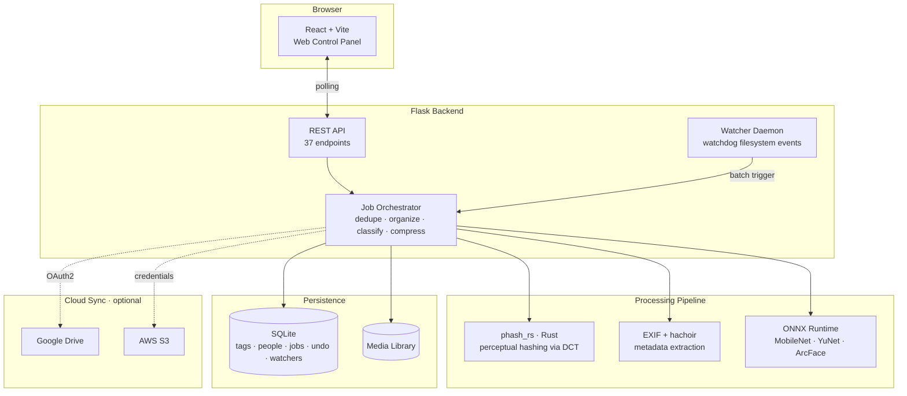

# Clean-Backup

**Intelligent media organization with perceptual deduplication, AI classification, and a hybrid Rust/Python architecture.**

<!-- Demo GIF placeholder — replace with actual recording once available -->
<!--  -->

[](https://github.com/JayacharanR/Clean-Backup/actions/workflows/ci.yml)
[](https://github.com/JayacharanR/Clean-Backup/actions/workflows/release.yml)


<!-- > 🔗 **Try it live:** [demo.clean-backup.onrender.com](https://demo.clean-backup.onrender.com) — read-only sample instance, no signup required -->

---

## Overview

Your photo library is a mess — thousands of files, duplicates across devices, no organization, no backups. Clean-Backup fixes that.

It scans your media library using **perceptual hashing** (not checksums — it catches resized, re-compressed, and format-converted duplicates), organizes files by date using EXIF metadata, classifies content with on-device ML (scene recognition, face detection, face naming), and optionally syncs to the cloud. Everything runs locally — no data leaves your machine.

The performance-critical image hashing is written in **Rust** (`phash_rs`), the ML pipeline uses **ONNX Runtime** for inference, and the web control panel is **React + Flask** — all packaged in a single Docker image.

## Quickstart

Run the full stack with zero setup:

```bash
docker run -p 8080:8080 -v ~/Photos:/data/media ghcr.io/jayacharanr/clean-backup:latest
```

Then open [http://localhost:8080](http://localhost:8080).

> **Note:** The media folder is mounted read-write so the app can deduplicate and organize your files. Always have a backup.

For persistent database and config, use [`docker-compose.yml`](docker-compose.yml):

```bash
# Copy and edit the env file
cp .env.example .env
# Start everything
docker compose up -d
```

## Architecture



## Features

### Perceptual Deduplication
- **Rust-accelerated pHash**: DCT-based perceptual hashing detects visual duplicates even after resize, recompression, or format conversion — not just byte-identical files.
- **Parallel hash computation**: Leverages Rayon's work-stealing thread pool in Rust for concurrent image hashing (`par_iter`), with automatic CPU core utilization.
- **Tunable sensitivity**: Hamming distance threshold from exact-match (0) to aggressive (10+), persisted between sessions.
- **Name-based detection**: Catches OS-generated duplicates (`file (1).jpg`, `file - Copy.jpg`) across Windows, macOS, and Linux patterns.
- **Safe review UI**: Grouped duplicate cards with side-by-side comparison, modal full-resolution preview, keyboard navigation, and protected best-image rules.

### Performance & Parallelization

Clean-Backup uses a **two-layer parallelization architecture** to maximize throughput:

| Layer | Technology | What it parallelizes |
|-------|-----------|---------------------|
| **Rust (native threads)** | Rayon work-stealing thread pool | Image decoding, DCT hash computation, Hamming distance comparisons |
| **Python (process pool)** | `multiprocessing.Pool` (N-1 cores) | File I/O, EXIF extraction, copy/move operations, compression |

- **Rayon `par_iter()` in Rust**: `find_duplicates_parallel()` and `compute_hashes_parallel()` use Rayon's data-parallel iterators to distribute image hashing across all CPU cores. Each image is independently decoded, resized, DCT-transformed, and hashed — a perfectly parallelizable workload.
- **Python multiprocessing for file operations**: The organizer spawns `cpu_count() - 1` worker processes (typically 15 on a 16-core machine) to handle concurrent file copies, moves, and metadata extraction.
- **10× speedup over pure Python**: The Rust pHash engine with Rayon multi-threading outperforms equivalent Python (Pillow + imagehash) implementations by an order of magnitude on batch duplicate scanning.
- **PyO3/Maturin bridge**: Rust functions are exposed as native Python functions via PyO3 with abi3 cross-version compatibility, achieving zero-copy data transfer for hash results.

### Organization & Classification
- **Date-based organization**: Extracts EXIF `DateTimeOriginal`, video container metadata, and filesystem stats to sort into `Year/Month` hierarchies.
- **AI scene classification**: MobileNetV3 ONNX model tags photos into 15 categories (travel, food, nature, documents, etc.) with configurable confidence thresholds.
- **Face detection & recognition**: YuNet face detection + ArcFace embeddings for automatic face grouping. Name people once, and the system recognizes them across your library.
- **Review queue**: Low-confidence classifications and unresolved face matches are surfaced for human review before any files move.

### Compression
- Three compression levels (high quality → maximum compression) for both images and videos.
- Parallel processing using all CPU cores. H.264 + AAC for video, libjpeg-turbo for JPEG.
- Detailed per-file analytics with compression ratios and space savings.

### Cloud Sync
- **Provider-agnostic**: Google Drive (OAuth2) and AWS S3 support via a pluggable `CloudProvider` interface.
- **Manifest-based incremental sync**: SHA-256 content hashing ensures only changed files are uploaded.
- **Secure credential storage**: OS keyring integration with Fernet-encrypted fallback.
- **Undo support**: Synced files can be removed from the cloud provider via the undo system.

### Watcher Daemon
- **Automatic folder monitoring**: Uses `watchdog` to detect new files in configured "drop folders."
- **Configurable pipelines**: Chain any combination of classify → organize → dedupe → cloud sync steps.
- **Debounced batching**: Files are debounced (stability window) and batched before pipeline execution to handle burst copies efficiently.

### Web Control Panel
- **Complete workflow tabs**: Duplicates, Organize, Compression, Classify, People, Review, Cloud Sync, Watchers, and Settings.
- **Background job execution**: Long-running operations run asynchronously with live progress polling.
- **Transactional undo**: Every file operation is journaled. Full session rollback with crash recovery.
- **Undo observability**: Session filtering, JSON export for auditing and recovery workflows.

## Tech Stack

| Layer | Technology |
|-------|-----------|
| **Performance-critical hashing** | Rust (2021 Edition) + Rayon thread pool via `maturin`/PyO3 |
| **Parallelization** | Rayon (Rust work-stealing threads) + Python `multiprocessing.Pool` |
| **Backend & ML pipeline** | Python 3.12+, Flask, ONNX Runtime |
| **Frontend** | React + Vite |
| **Database** | SQLite (WAL mode) |
| **ML models** | MobileNetV3 (scene), YuNet (face detect), ArcFace (face embed) |
| **Image processing** | Pillow, pillow-heif (HEIC), OpenCV |
| **Video metadata** | hachoir, FFmpeg (compression) |
| **Cloud providers** | Google Drive API, AWS S3 (boto3) |
| **Containerization** | Docker (multi-stage build) |

## Local Development

### Prerequisites
- Python 3.12+
- Rust toolchain (for `phash_rs`)
- Node.js 20+ (for frontend)
- FFmpeg (optional, for video compression)

### Setup

```bash
# Clone
git clone https://github.com/JayacharanR/Clean-Backup.git
cd Clean-Backup

# Python environment
python -m venv .venv
source .venv/bin/activate  # Windows: .venv\Scripts\activate
pip install -r requirements.txt

# Build Rust module
cd phash_rs && maturin develop --release && cd ..

# Build frontend
cd web && npm install && npm run build && cd ..

# Run
python main.py        # CLI mode
python main.py --web  # Web GUI at http://localhost:8080
```

## Privacy

Clean-Backup runs **100% offline**. All machine learning models (ONNX) are baked into the Docker image and require no cloud API calls. Face embeddings and classification tags are stored only in your local SQLite database. No telemetry, no analytics, no data leaves your machine.

Cloud sync is entirely optional and user-initiated — credentials are stored in your OS keyring or encrypted locally.

## License

MIT License — see [LICENSE](LICENSE) for details.

---

*Built by [JayacharanR](https://github.com/JayacharanR)*
